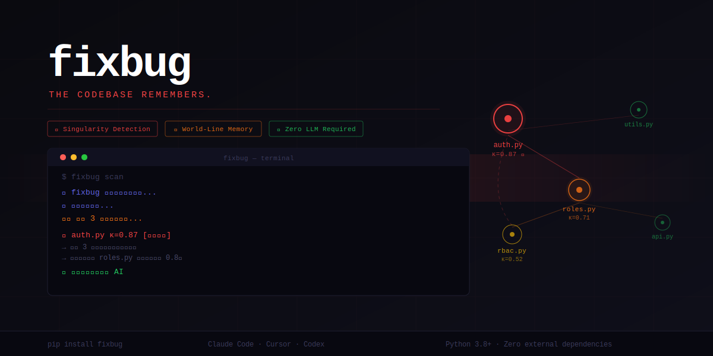
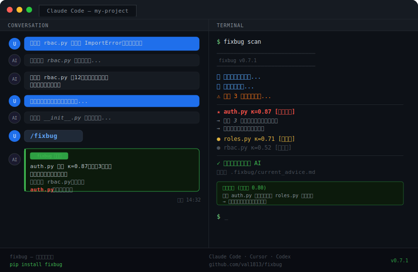

<div align="center">



</div>

<div align="center">

```
███████╗██╗██╗  ██╗██████╗ ██╗   ██╗ ██████╗
██╔════╝██║╚██╗██╔╝██╔══██╗██║   ██║██╔════╝
█████╗  ██║ ╚███╔╝ ██████╔╝██║   ██║██║  ███╗
██╔══╝  ██║ ██╔██╗ ██╔══██╗██║   ██║██║   ██║
██║     ██║██╔╝ ██╗██████╔╝╚██████╔╝╚██████╔╝
╚═╝     ╚═╝╚═╝  ╚═╝╚═════╝  ╚═════╝  ╚═════╝
```

**代码库的记忆 · The codebase remembers.**

*用得越久越聪明。零配置。无需大模型。*
*Gets smarter every time you use it. Zero config. Zero LLM required.*

---

[](https://pypi.org/project/fixbug)
[](LICENSE)
[](https://github.com/val1813/fixbug)
[](https://python.org)
[](https://github.com/val1813/fixbug)

</div>

---

## 它是什么 · What is fixbug?

大多数 AI 编程助手每次启动都是白板一张——不知道上周哪里出了问题，不知道哪个文件才是真正的根因，也没有任何方式变得更聪明。

**fixbug 不一样。**

它为你的代码库构建一张**行为图**——一张活的地图，记录哪些文件有风险、哪些文件在悄悄导致下游失败、历史上的 bug 呈现什么规律。每一次测试失败、每一次修复、每一次改动都被记录下来。图在生长，智慧在积累。

然后它在 AI 浪费时间在错误文件之前，告诉它该去看哪里。

---

Most AI coding agents start fresh every session. They have no memory of what broke last week, no idea which file is the real root cause, and no way to get smarter over time.

**fixbug is different.**

It builds a **behavior graph** of your codebase — a living map of which files are risky, which ones silently cause downstream failures, and what the historical pattern of bugs looks like. Every test failure, every fix, every change is recorded. The graph grows. The intelligence accumulates.

Then it tells your AI exactly where to look — before it wastes time in the wrong file.

---

## 核心洞见 · The Core Idea

```
代码库有形状。
Bug 有引力。
fixbug 同时测量两者。

Your codebase has a shape.
Bugs have a gravity.
fixbug measures both.
```

当 `rbac.py` 一直报错，但真正的问题在上游两跳之外的 `roles.py`——fixbug 能找到它。不是靠猜，而是靠追踪**曲率**：失败信号沿依赖图向上游传播所积累的压力。

报错的文件，很少是造成错误的文件。

When `rbac.py` keeps failing but the real problem is in `roles.py` two hops upstream — fixbug finds it. Not by guessing. By tracking **curvature**: the accumulated pressure of failures propagating through the dependency graph.

The file that *shows* the error is rarely the file that *causes* it.



---

## 核心功能 · Features

### 🔍 行为图分析 · Behavior Graph Analysis
通过 AST 静态分析 + git 历史 + 运行时追踪，构建整个项目的函数级依赖图。每个节点获得一个曲率分数——失败压力的量化值。

Builds a function-level dependency map using AST static analysis + git history + runtime tracing. Every node gets a curvature score — a measure of failure pressure.

### ★ 奇点识别 · Singularity Detection
核心杀手锏。识别**跨文件根因**——高曲率、下游多次失败、但自身从无直接失败记录的节点。你的 bug 的隐藏来源。

The killer feature. Identifies **cross-file root causes** — nodes with high curvature, downstream failures, but zero direct failures themselves. The hidden source of your bugs.

### 🧠 世界线记忆 · World-Line Memory
每次测试失败和修复都记录在持久化世界线中。系统学会哪些节点是慢性问题节点，哪些修复方式有效，并在下次浮出这些知识。

Every test failure and fix is recorded in a persistent world-line. The system learns which nodes are chronically problematic, which fixes worked, and surfaces that knowledge next time.

### ⚡ AI 工具自动注入 · Auto-injection into AI Tools
Claude Code 用户获得自动 hook 集成——fixbug 在每次 AI 任务前静默运行，告诉 AI 该去看哪里。无需任何命令。

Claude Code users get automatic hook integration — fixbug runs silently before every AI task. No commands needed.

### 🌐 多语言支持 · Multi-language Support
Python（深度 AST）、JavaScript、TypeScript、JSX、TSX，自动识别语言。

Python (deep AST), JavaScript, TypeScript, JSX, TSX — automatic language detection.

### ☁️ 云端经验共享 · Cloud Experience Sharing
有 API key 后，你的匿名修复规律贡献到共享知识库。新项目冷启动即可继承数千个类似代码库的经验。

With an API key, your anonymized fix patterns contribute to a shared knowledge base. Cold-start with inherited wisdom from thousands of similar codebases.

---

## 安装 · Installation

```bash
pip install fixbug
```

就这一行。无配置文件，无环境设置，本地使用无需 API key。

That's it. No configuration files, no environment setup, no API keys required for local use.

---

## 快速开始 · Quick Start

```bash
# 第一步：初始化（每个项目只需一次）
# Step 1: Initialize (one time per project)
cd your-project/
fixbug begin

# 第二步：出问题时扫描
# Step 2: Scan whenever something breaks
fixbug scan
```

```
━━━━━━━━━━━━━━━━━━━━━━━━━━━━━━━━━━━━━━━━━━
  fixbug
━━━━━━━━━━━━━━━━━━━━━━━━━━━━━━━━━━━━━━━━━━
🔍 fixbug 正在扫描项目结构...
📊 正在计算曲率...
⚠️  发现 3 个高风险节点...

  ★ auth.py  κ=0.87  [根因候选]
    → 下游 3 次失败，自身未直接出错
    → 建议先读这里，不是报错的文件
    → 经验：上次通过修复 roles.py 解决（置信度 0.8）

  ● roles.py  κ=0.71  [高风险]
  ● rbac.py   κ=0.52  [中风险]

✓  完成，结果已告知 AI
━━━━━━━━━━━━━━━━━━━━━━━━━━━━━━━━━━━━━━━━━━
```

---

## 命令一览 · Commands

| 命令 · Command | 功能 · What it does |
|---------------|---------------------|
| `fixbug begin` | 初始化，注入 AI 工具配置 · Initialize, inject into AI tool |
| `fixbug scan` | 扫描 + 修复建议 · Scan + repair suggestions |
| `fixbug api YOUR_KEY` | 设置 API key，启用云端 · Enable cloud features |
| `fixbug sync yes\|no` | 云端上传开关 · Toggle cloud upload |
| `fixbug status` | 当前状态 + 账号信息 · Status + account info |
| `fixbug dashboard` | 打开浏览器热力图 · Open browser heatmap |
| `fixbug reset` | 清空本地记忆 · Clear local memory |

---

## AI 工具集成 · AI Tool Integration

运行 `fixbug begin`，选择你的工具：

```
  1. Claude Code   (CLAUDE.md + 自动 hooks · automatic hooks)
  2. Cursor        (.cursorrules · manual /fixbug)
  3. Codex         (AGENTS.md · manual trigger)
  4. All           (全部注入 · inject all)
```

### Claude Code — 全自动模式 · Full Auto Mode

fixbug 注册 `PreToolUse` hook，在每次 AI 开始任务前自动触发。无需任何命令。你的 AI 会说：

fixbug registers a `PreToolUse` hook that fires automatically before every AI task. No commands needed. Your AI will say:

> *"fixbug 提醒我：auth.py 曲率 0.87，下游 3 次失败但自身无直接错误记录，建议先读 auth.py 而不是直接修改报错文件。"*

然后直接去看正确的文件。Then it goes straight to the right file.

### Cursor & Codex — 手动模式 · Manual Mode

在对话框输入 `/fixbug`。AI 读取扫描结果，以同样方式行动。

Type `/fixbug` in the chat. The AI reads the scan result and acts on it the same way.

---

## 曲率是怎么工作的 · How the Curvature Works

```
rbac.py 测试失败 · Test fails in rbac.py
       │
       ▼  沿依赖链向上游传播 · propagates upstream
   roles.py  ←── 曲率 +0.05 · gets curvature +0.05
       │
       ▼  再往上两跳 · two hops up
   auth.py   ←── 曲率 +0.025 · gets curvature +0.025

3 次失败后 · After 3 failures:
   roles.py  κ = 0.71  ● 直接修复目标 · direct fix target
   auth.py   κ = 0.87  ★ 奇点，优先排查 · singularity — investigate first
   rbac.py   κ = 0.52  ● 症状，不是根因 · symptom, not cause
```

数学很简单，洞见不简单。The math is simple. The insight is not.

`Δκ(n) = seed_κ × decay^distance`

失败沿调用图向上游传播，强度指数衰减。积累曲率但无直接失败的节点就是**奇点**——隐藏的根因。

Failures propagate upstream through the call graph with exponential decay. Nodes that accumulate curvature without direct failures are **singularities** — the hidden root causes.

---

## 世界线记忆 · World-Line Memory

每个项目获得一个 `.fixbug/memory.json`——每次失败和修复的追加记录，按节点组织。

Every project gets a `.fixbug/memory.json` — an append-only record of every failure and fix, organized by node.

```json
{
  "world_lines": {
    "roles": {
      "events": [
        { "kind": "failure", "ts": "2026-03-20T10:22:00Z", "detail": "ImportError" },
        { "kind": "failure", "ts": "2026-03-21T14:11:00Z", "detail": "ImportError" },
        { "kind": "fix",     "ts": "2026-03-22T09:45:00Z", "detail": "fixed upstream" }
      ]
    }
  }
}
```

记忆驱动经验规则 · This memory drives the experience rules:

- **3+ 次失败，0 次修复** → 优先检查上游依赖 · "check upstream dependencies first"
- **修复后稳定** → 这个方式有效，下次继续 · "this pattern worked, use it again"
- **5+ 次失败仍未收敛** → 需要人工介入 · "human intervention needed"

---

## 云端经验共享 · Cloud Experience Sharing

```bash
fixbug api YOUR_KEY     # 设置一次 · set once
fixbug sync yes         # 开启自动上传 · enable auto-upload
```

有 key 后，你的匿名修复规律（无代码内容、无文件名，只有曲率形状和规则类型）贡献到共享知识库。

新项目冷启动即继承类似代码库的经验。

With a key, your anonymized fix patterns (no code content, no file names — just curvature shapes and rule types) are contributed to the shared knowledge base. New projects cold-start with inherited wisdom.

获取 key · Get a key: **valhuang@kaiwucl.com**

---

## CI/CD 集成 · CI/CD Integration

```bash
# 超过曲率阈值时 build 失败
# Fail the build if any node exceeds curvature threshold
fixbug scan --ci --fail-above 0.85

# JSON 输出供下游处理
# JSON output for downstream processing
fixbug scan --json | jq '.singularities'

# 安装 pre-commit hook
# Install pre-commit hook
fixbug begin --init-hook
```

---

## 语言支持 · Language Support

| 语言 · Language | 静态分析 · Static Analysis | 运行时追踪 · Runtime Tracing | Git 历史 · Git History |
|----------------|--------------------------|-----------------------------|-----------------------|
| Python | ✓ 深度 AST · Deep AST | ✓ sys.settrace | ✓ |
| JavaScript | ✓ 正则 + 导入 · Regex + imports | — | ✓ |
| TypeScript | ✓ 正则 + 导入 · Regex + imports | — | ✓ |
| JSX / TSX | ✓ | — | ✓ |
| Java, Go, Rust | ✓ Git 历史 · Git history only | — | ✓ |

```bash
# 扫描 JS/TS 项目 · Scan a JS/TS project
fixbug scan --lang js
```

---

## fixbug 不是什么 · What fixbug is NOT

- ❌ 不是 linter，不检查代码风格 · Not a linter
- ❌ 不是静态分析器，不靠读代码找 bug · Not a static analyzer
- ❌ 不是大模型包装器，核心引擎是纯规则和统计 · Not an LLM wrapper

它是一个**故障记忆**，具备对代码库的**空间理解**。运行时间越长，它就越了解你的代码库。

It's a **failure memory** with a **spatial understanding** of your codebase. The longer it runs, the more it knows.

---

## 常见问题 · FAQ

**会把我的代码上传到云端吗？· Does it send my code to the cloud?**

不会。只上传匿名化的曲率值和规则类型，从不上传代码内容、文件名或项目结构。**以党员身份保证，绝不上传任何隐私信息、包括但不限用户信息、文件名、代码等等**

No. Only anonymized curvature values and rule types are uploaded. Never code content, file names, or project structure.

**需要大模型才能工作吗？· Does it need an LLM to work?**

不需要。整个引擎——曲率计算、奇点识别、经验规则——是纯 Python，零外部依赖。大模型是你的 AI 编程工具，fixbug 只是告诉它去哪里看。

No. The entire engine is pure Python with zero external dependencies. The LLM is your AI coding tool. fixbug just tells it where to look.

**多久开始有用？· How long until it gets useful?**

结构分析立即有效。10-20 次测试循环后，世界线记忆开始产生有意义的规则。50 次以上，它就了解你的代码库了。

Immediately useful for structural analysis. After 10-20 test cycles, meaningful rules emerge. After 50+, it knows your codebase.

**没有测试也能用吗？· Does it work without tests?**

可以。静态分析和 git 历史无需测试即可工作。动态世界线功能需要 pytest 或类似工具。

Yes. Static analysis and git history work without any tests. Dynamic world-line features require pytest or similar.

---

## 参与贡献 · Contributing

```bash
git clone https://github.com/val1813/fixbug
pip install -e ".[dev]"
python -m fixbug.validate --json    # 运行内部验证套件 · run validation suite
```

欢迎 PR 和 Issue。Welcome PRs and Issues.

---

<div align="center">

**fixbug** — *代码库的记忆 · The codebase remembers.*

用偏执的态度对待根因。Made with obsessive attention to root causes.

[获取 API Key · Get API Key](mailto:valhuang@kaiwucl.com) · [提交 Issue · Report Issue](https://github.com/val1813/fixbug/issues) · [Star on GitHub ⭐](https://github.com/val1813/fixbug)

</div>
